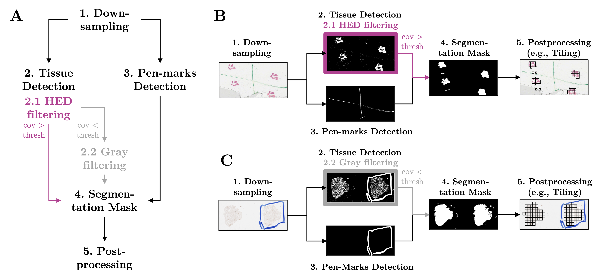
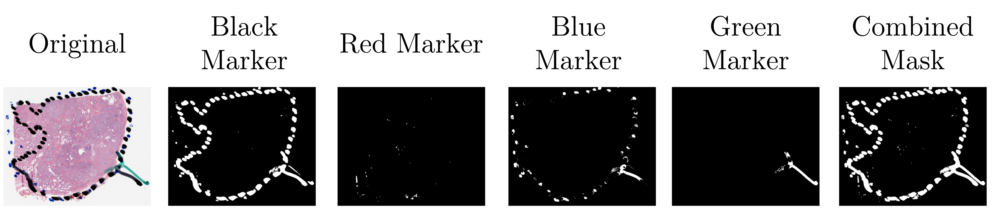
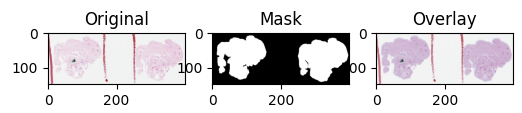
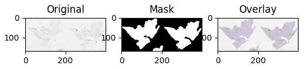

# Tissue Segmentation

:warning: THIS IS A WORK IN PROGRESS. Over the next few weeks, we will add some additional features (e.g., choosing the slide level or the resizing factor; adding the opportunity to compare with other methods). So stay tuned! If you have any feedback, please reach out (Greta Markert; :email: gm694 at cam.ac.uk)!! We want this to be used by as many people to make it as robust as possible, so every feedback is very much appreciated.

This script takes whole slide images (typically .svs or .ndpi files; either from biospsies or Cytosponge etc) as an input and returns an image file (typically .png file) of the mask of where the tissue is located (black: tissue, white: background). The script runs really fast and does not need any gpu capacity as it relies on basic pixel filtering.

The script introduces three concepts: Increasing the contrast, using HED filtering or gray filtering, and removing pen marks automatically. These are the default settings, they can however be changed in the options.
The general idea is to first filter for Eosin (pink part of H&E staining). If less than 5% of the whole slide is covered by Eosin (this threshold can be adjusted using the parameter `he_cutoff_percent`; can be turned of by using the parameter `gray_only`), there will be automatic grey filtering (can be turned of by using the parameter `he_only`). In a next step, we make a pen marker mask (needs to be specified `--pen_markers` or the specific colours `--blue_marker`/`red_marker`/`green_marker`/`black_marker`). The pen marker mask is substracted from the previous tissue filtering resulting in the final tissue segmentation.






The script works both with specific files (`wsi_file`) or file directories (`wsi_dir`), where it filters for files ending with either '.svs' or '.ndpi'.
There are two different ways of filtering: Either filtering on the grey scale (not ideal with lots of artifacts, as they will also be treated as tissue; works well with all stainings), or hed scale (developed for H&E slides with lots of artifacts). For the grey scale, one can manually change the threshold of the pixels that will be filtered (`grey_threshold`). This threshold are the default for the Cytosponge. For biospsies, they can vary heavily.
One important parameter is `contrast`. Depending on how the staining was performed and with dye was used, good values for contrasts can vary from 3 to 30. As H&E stains are usually more intense, 3 is a good number to start with. For grey stains such as TP53, 20 is a good number to start with.
When the tissue is split into several small pieces, it is recommended to reduce the number of `min_number_pixel` to e.g., 10. 
For finding the right thresholds and contrast, one can look at some examples using the `show` parameter.
The output of this parameter is shown here, where the mask is the output of the script:
- Example of H&E staining using default parameters
- Example of TFF3 staining using default parameters


.svs and .ndpi files can have a varying number of levels with very different resolutions even in the last level (aka the most zoomed out ones). Automatically, the highest level where the width is above `min_width` is chosen. However, if the level has a very high resolution, then the script will take longer to run. Usually, a width of 1000 pixels is enough to get good outlines for the tissue. When specifying `resize`, then instead of the level's resolution, the size of the mask will be resized to the width of `min_width` and the height will automatically be adjusted to fit the original proportions.


## Requirements

Python 3.6 or later with the following packages:

- `argparse`
- `os`
- `openslide`
- `torch`
- `numpy`
- `matplotlib`
- `PIL`
- `shapely`
- `skimage`
- `cv2`
- `time`
- `tqdm`
- `random`

The requirements can be installed with pip:

```bash
pip install -r requirements.txt
```

## Usage

You can run the script using the following command:
```bash
python TissueSegmentationAllInOne.py --wsi_dir <path_to_images> [options]
```

### Options
`--wsi_dir`: Path to the directory containing the whole slide images.

`--wsi_file`: Path to a single whole slide image.

`--grey_threshold`: Threshold for the grey-based segmentation. Default is 210.

`--hed_contrast`: Contrast increase for HED space. Default is 1.

`--gray_contrast`: Contrast increase for gray space (usually for IHC images)

`--min_number_pixel`: Filters out small areas. Default is 25. If higher, than only bigger areas will be part of the final mask. Use this, if you want to ignore smaller dots.

`--min_width`: Minimum width of the tissue mask. Default is 1200.

`--resize`: Whether to resize the mask to have a width of min_width. Default is True.

`--save`: Whether to save the tissue mask. Default is True.

`--save_dir`: Directory where the tissue mask should be saved. If None, the mask will be saved in the same directory as the whole slide image.

`--save_ending`: File ending and format of the tissue mask. Default is '_mask.png'.

`--show`: Whether to show the plot of the tissue mask.

`--show_detailed`: Whether to show the plot of the tissue mask in different stages of the algorithm.

`--pen_markers`: Add, if you have pen markers that need to be removed. This includes all pen marker colours. They can also be included separately, then add `--blue_marker`, `--red_marker`, `--black_marker`, and `--green_marker`, respectively (instead of `--pen_markers`).

`--filter_kernel` (default=5) and `--dilute` are parameters specific to the removal of the pen markers. You can increase the kernel size to cut out more of the space around the detected tissue.

`--he_cutoff_percent` (default=5). If less than 5% of the tissue are covered by Eosin (according to the filtering), we assume that the slide is not H&E stained but rather IHC stained. Therefore, we automatically do the gray filtering instead. If you have only very little H&E tissue on your slide, you can decrease this number.

### Example

```bash
# If you have a full directory of svs or ndpi files
python TissueSegmentationAllInOne.py --wsi_dir /path/to/images

# If you just have one specific file that you want to run
python TissueSegmentationAllInOne.py --wsi_file /path/to/image
```
